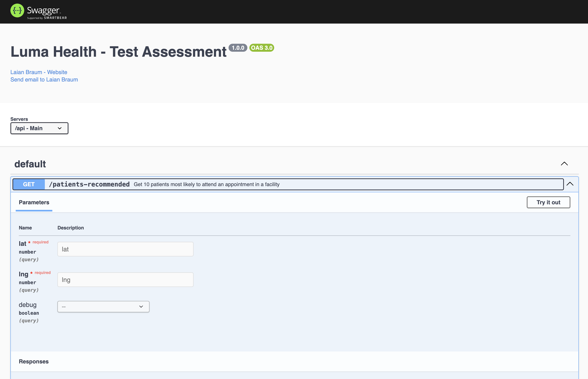
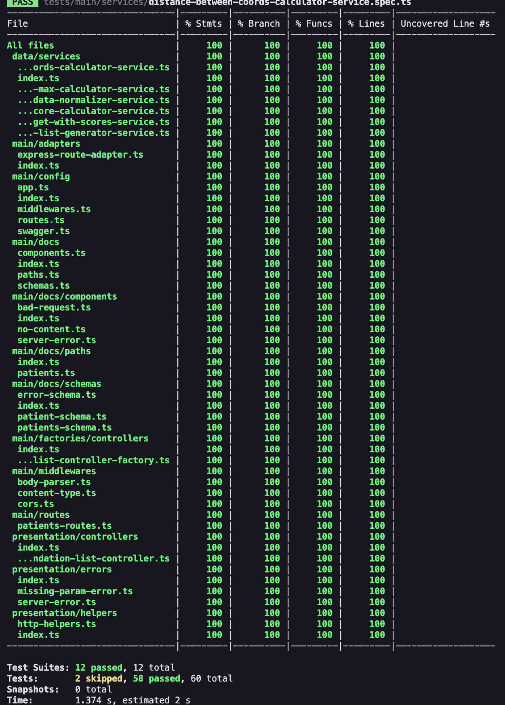

# Luma Health Test Assessment

## Overview

This project is a test assessment for a Software Engineer position at Luma Health.

**Goal**: Increase the efficiency of the front desk staff by providing a prioritized list of patients who are most likely to respond positively, reducing the time spent contacting patients who may not be available.

This API leverages patient demographics and behavioral data to compute a score (higher is better) that represents how likely a patient is to accepting an appointment offer.

## How?

1. **Data Normalization**

   - A patient has different data fields, where each one has its own characteristics. Data Normalization transforms this data into a common scale, normally from 0 to 1, allowing one to evaluate and grade patients equally.

2. **Multi-Criteria Decision Analysis (MCDA):**

   - Weighs patient behavior and demographic factors to calculate a score.

3. **Penalty Adjustment:**

   - Applies a penalty for patients too far from the facility (more than 100km), increasing the importance of distance, since the distance weight is only 10%. _(I can't change the weights because it is a requirement, but it doesn't say anything about applying penalties... As one said in The Office: "I just Kobayashi Maru'd the whole thing")_

4. **Randomization of patients with low behavior score:**
   - Patients that score poorly on behavior metrics most likely will have a overall bad score and won't be placed above the top. However, the poor behavior might be due to lack of invites, thus the need to provide such patients a chance to still be invited for appointments.

## Technologies & Concepts Used

- **Typescript** (I started with JS and only moved to TS later)
- **Node.js**
- **Express.js**
- **Jest**
- **Swagger**
- **Clean Architecture**
- **Multi-Criteria Decision Analysis (MCDA)**
- **Haversine Formula** (Used for calculating distance between two coordinates).

## API Endpoints

### 1. **`GET /api/patients-recommended`**

- **Description:** Returns an ordered list of patients most likely to accept an appointment.
- **Parameters:**
  - `latitude` (required): Latitude of the facility.
  - `longitude` (required): Longitude of the facility.
- **Response:**
  - A JSON array of patients with their computed scores.
- **Swagger Documentation:** Available at `/api-docs`

## Installing and running

```bash
git clone https://github.com/lzizn/backend-interview.git
cd backend-interview
npm install
npm run dev # runs dev server with nodemon
# or
npm run start # transpiles from TS to JS (dist/) and runs with node
```

## Running Tests

The project includes unit tests written with **Jest** to ensure the reliability of key functions like normalization and patient scoring.

```bash
npm run test # runs all tests
npm run test:coverage # runs all tests and collects coverage report
npm run test:unit # only unit tests
npm run test:integration # only integration tests
```

## Swagger

Access the Swagger UI and see the full API documentation on **GET** `/api-docs`



## Test Coverage

This project has 100% of test coverage, including unit and integration tests.



---

<br />
<br />

# Original Assessment Task:

#### Problem Definition

A busy hospital has a list of patients waiting to see a doctor. The waitlist is created sequentially (e.g. patients are added in a fifo order) from the time the patient calls. Once there is an availability, the front desk calls each patient to offer the appointment in the order they were added to the waitlist. The staff member from the front desk has noticed that she wastes a lot of time trying to find a patient from the waitlist since they&#39;re often not available, don&#39;t pick up the phone, etc. She would like to generate a better list that will increase her chances of finding a patient in the first few calls.

#### Interview Task

Given patient demographics and behavioral data (see sample-data/patients.json), create an algorithm that will process a set of historical patient data and compute a score for each patient that (1 as the lowest, 10 as the highest) that represents the chance of a patient accepting the offer off the waitlist. Take in consideration that patients who have little behavior data should be randomly added to the top list as to give them a chance to be selected. Expose an api that takes a facility's location as input and returns an ordered list of 10 patients who will most likely accept the appointment offer.

#### Weighting Categories

Demographic

- age (weighted 10%)
- distance to practice (weighted 10%)

Behavior

- number of accepted offers (weighted 30%)
- number of cancelled offers (weighted 30%)
- reply time (how long it took for patients to reply) (weighted 20%)

#### Patient Model

- ID
- Age (in years)
- location
  - Lat
  - long
- acceptedOffers (integer)
- canceledOffers (integer)
- averageReplyTime (integer, in seconds)

#### Deliverables

The code should be written as a Node.js as a library that anyone can import and use. It should contain documentation and unit tests that show your understanding of the problem. Once you&#39;re finished, submit a PR to this repo.
